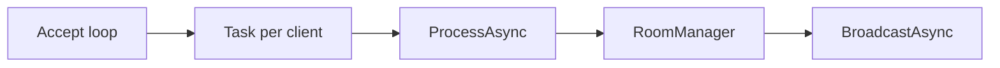

# App Logic + Socket Logic (CanvasApp)

Tài liệu này giải thích chi tiết luồng xử lý App Logic + Socket Logic trong CanvasApp, từ khi client mở kết nối TCP đến khi thông điệp được xử lý, lưu vào DB, và broadcast đến các client khác. Tập trung vào các thành phần chính ở Server, Client, và Load Balancer.

---

## 1. Tổng quan kiến trúc kết nối

CanvasApp sử dụng TCP thuần, không dùng SignalR/WebSocket. Mỗi thông điệp được gửi theo định dạng JSON + newline (line-delimited JSON). Mỗi dòng JSON là 1 thông điệp hoàn chỉnh. Đọc bằng StreamReader.ReadLineAsync() và ghi bằng StreamWriter.WriteLine().

**Ba lớp kết nối chính:**

* **Load Balancer (LB)**: nhận kết nối từ client, peek message đầu tiên để route đến Auth pool hoặc Canvas pool.
* **Canvas Server**: xử lý toàn bộ luồng vẽ, chat, room, auto-save, broadcast.
* **Client (WinForms)**: mở TCP kết nối đến LB/Canvas, send/receive message, vẽ UI, và reconnection.

---

## 2. Socket Logic trên Server (CanvasApp.Server)

### 2.1. TCP Listener và accept loop

Canvas Server mở TcpListener trên port (mặc định 9002) và chấp nhận client liên tục.

* Mỗi client tạo ra 1 Task xử lý riêng (HandleClient).
* Mỗi kết nối TCP có 1 StreamReader/StreamWriter riêng.

**Lý do:** 1 task/client giúp không block trong khi một client bị trễ, và tạo concurrency cho nhiều user.

### 2.2. HandleClient: vòng đọc line và dispatcher

Server đọc từng dòng JSON, parse thành Message, sau đó dispatcher vào ProcessAsync.

Quản lý kết nối:

* Chỉ log connected khi đã nhận được 1 dòng data (tránh log health-check connect/close).
* Khi ReadLineAsync() trả về null hoặc exception, server gọi Leave() và broadcast danh sách thành viên mới.

### 2.3. ProcessAsync: auth + switch case

ProcessAsync là trung tâm xử lý App Logic. Trình tự:

1. **Kiểm tra payload size** (anti-abuse, ~4MB cap).
2. **Verify token HMAC-SHA256** (trừ PING). Token format `base64(payload).base64(HMAC(payload, secret))`. So sánh MAC bằng `FixedTimeEquals` để không leak timing.
3. **Switch msg.Type** xử lý từng loại message.

Các nhóm chính:

* **ROOM_***: list, create, resolve (routing-only pre-join), join, leave, delete, update password.
* **DRAW_***: start, move, end, shape, text, fill, undo, clear, image, image_transform.
* **CHAT_***: message, file. (CHAT_HISTORY giờ embedded trong ROOM_JOIN_RESULT).
* **CANVAS_STATE**: re-sync full snapshot + deltas on demand.
* **PING/PONG**: keepalive.

Mọi event sau khi xử lý local còn được `PEER_RELAY` sang các canvas server khác để đồng bộ multi-server.

### 2.4. RoomManager: logic domain

RoomManager chịu trách nhiệm:

* Quản lý danh sách phòng (_rooms).
* Danh sách user trong phòng (_roomClients).
* Trạng thái canvas theo room (_canvasState).
* Undo stack theo user/room.
* Snapshot cache và load from DB khi join.

Nhóm chức năng quan trọng:

* **CreateRoom**: tạo room, lưu DB, tạo invite code.
* **Join**: kiểm tra password, load snapshot, add vào room, cập nhật member list.
* **Leave**: remove client, đánh dấu room empty, thông báo lobby.
* **BroadcastAsync**: gửi message đến tất cả client trong phòng (trừ sender nếu cần).
* **RecordDrawAction**: gắn SeqNo, ActionId, enqueue vào persistence.
* **AutoSave**: định kỳ gom snapshot lưu DB.

---

## 3. Socket Logic trên Client (CanvasApp.Client)

### 3.1. LobbyClient: socket ngắn hạn

LobbyClient mở socket đến LB cho các request 1 lần, sau đó đóng ngay.

* Dùng cho ROOM_LIST, ROOM_CREATE, ROOM_RESOLVE, RESOLVE_INVITE_CODE, ROOM_DELETE, ROOM_UPDATE_PASSWORD.
* Mục tiêu: LB peek message **đầu tiên** trên mỗi socket để route. Nếu dùng 1 socket cho nhiều request thì chỉ message đầu được route đúng, các message sau ride pipe sai.
* `ROOM_RESOLVE` chỉ trả về `ServerHost`/`ServerPort` (không admit user) → sau khi đóng socket LB, client trực tiếp connect tới canvas server đúng và gửi `ROOM_JOIN` **một lần duy nhất** trên socket persistent.

### 3.2. CanvasClient: socket persistent

CanvasClient duy trì 1 kết nối dài hạn đến Canvas Server để:

* Nhận realtime draw/chat/broadcast.
* Gửi DRAW_* và CHAT_*.
* PING/PONG keepalive.
* Tự động reconnect nếu bị drop.

Các điểm kỹ thuật:

* **Send lock**: serialize StreamWriter.WriteLineAsync để tránh interleaving JSON.
* **Heartbeat**: PING mỗi 10s, server trả PONG.
* **Reconnect loop**: exponential backoff, tối đa 10 lần.
* **Connection generation**: tránh trigger OnDisconnected khi có switch server (LB -> Canvas).

### 3.3. Threading flow (server)

---

## 4. Luồng vẽ nét (DRAW_*) end-to-end

Đây là luồng "1 nét vẽ" từ client A sang client B:

1. **Client A** vẽ trên CanvasForm -> tạo DrawAction.
2. **CanvasClient.SendDrawAsync** gửi Message(DRAW_END, action).
3. **LB** nhận message, nhận diện Type = DRAW_END -> route vào Canvas Server.
4. **Canvas Server** ProcessAsync nhận DRAW_END.
5. **RoomManager.RecordDrawAction** gắn SeqNo, ActionId, enqueue DB.
6. **BroadcastAsync** gửi cho tất cả client trong phòng (trừ sender).
7. **Client B** nhận trong ReceiveLoop -> UI vẽ lại nét.

Dấu hiệu log cho demo:

* Server log [Room] ... joined và [AutoSave] Snapshot ....
* Client B vẽ nét ngay sau khi client A vẽ.

---

## 5. Luồng tạo phòng và join phòng

### 5.1. Tạo phòng (ROOM_CREATE)

1. Client gọi LobbyClient.CreateRoomAsync.
2. Socket ngắn hạn đến LB, LB route vào Canvas Server.
3. Server tạo room, lưu DB, log [Room] Created ....
4. Client nhận ROOM_CREATE_RESULT và đóng socket.

### 5.2. Join phòng (ROOM_RESOLVE → connect → ROOM_JOIN)

1. Client đã có token.
2. Client gọi LobbyClient.ResolveRoomAsync (socket ngắn hạn qua LB).
3. LB route sticky theo RoomId → canvas server đúng. Server check password (under `lock(room)`), trả `ROOM_RESOLVE_RESULT { ServerHost, ServerPort, RequiresPassword }`. **KHÔNG** add user vào `_roomClients`.
4. LB socket đóng.
5. Client mở socket persistent đến `ServerHost:ServerPort` (CanvasClient.ConnectToServerAsync).
6. Client gửi `ROOM_JOIN` **một lần** trên socket persistent.
7. Server fetch chat history snapshot **trước** khi admit (tránh race history vs live), add member, load canvas state, trả `ROOM_JOIN_RESULT { Room, Members, SnapshotData, CanvasState, ChatHistory }`.
8. Server broadcast `ROOM_UPDATE` cho các user khác, publish `PEER_RELAY(ROOM_UPDATE)` sang các peer.

---

## 6. Socket Logic và Load Balancer

LB đọc thông điệp đầu tiên để route:

* **AUTH_*** (LOGIN/REGISTER/SEND_OTP/FORGOT_SEND_OTP/RESET_PASSWORD) -> Auth pool, round-robin.
* **ROOM_JOIN**, **ROOM_RESOLVE**, **ROOM_JOIN_BY_CODE (w/ RoomId)** -> Canvas pool, sticky route theo RoomId (`RouteForRoom`). Bind vào table nếu chưa có.
* **ROOM_DELETE**, **ROOM_UPDATE_PASSWORD** -> Canvas pool, `RouteForRoomReadOnly` (sticky nếu đã bind, nếu không thì least-loaded; **không** tạo binding mới — metadata operation).
* **default** (ROOM_LIST, RESOLVE_INVITE_CODE, DRAW_*, CHAT_*) -> Canvas pool, least-loaded.

LB còn intercept `ROOM_CREATE_RESULT` để pre-register binding cho server vừa tạo room, và intercept `ROOM_DELETE_RESULT` (Success=true) để `UnregisterRoom` (giảm RoomCount).

---

## 7. Các điểm kỹ thuật quan trọng

* **Line-delimited JSON**: mỗi message là 1 dòng. Interleaving bytes sẽ làm JSON bị lỗi.
* **StreamWriter không thread-safe**: server và client đều dùng lock để serialize send.
* **Token check**: mỗi message (trừ PING) đều verify token.
* **Reconnect**: client tự động reconnect khi server down, giúp demo không bị crash.
* **AutoSave + Snapshot**: tránh load full action list, chỉ load snapshot + delta.

---

## 8. Mapping log thông thường

* [+] Client ... connected -> server nhận dòng data đầu tiên.
* [Room] Created ... -> ROOM_CREATE.
* [Room] X joined ... -> ROOM_JOIN.
* [Room] X left ... -> disconnect/ROOM_LEAVE.
* [AutoSave] Snapshot ... -> auto save timer.
* Unable to read data ... aborted -> client đóng socket đột ngột.

---

## 9. File liên quan cần mở khi demo

* Accept loop + main: [CanvasApp.Server/Program.cs:38-179](../../CanvasApp.Server/Program.cs#L38-L179)
* Per-client handler (HandleClient): [CanvasApp.Server/Program.cs:285-352](../../CanvasApp.Server/Program.cs#L285-L352)
* Message dispatcher (ProcessAsync): [CanvasApp.Server/Program.cs:354-728](../../CanvasApp.Server/Program.cs#L354-L728)
* RoomManager — Create/Resolve/Join/Leave/Broadcast: [CanvasApp.Server/RoomManager.cs:237-770](../../CanvasApp.Server/RoomManager.cs#L237-L770)
* RoomManager — RecordDrawAction + persistence: [CanvasApp.Server/RoomManager.cs:852](../../CanvasApp.Server/RoomManager.cs#L852)
* Client persistent socket: [CanvasApp.Client/Network/CanvasClient.cs](../../CanvasApp.Client/Network/CanvasClient.cs)
* Lobby short-lived socket: [CanvasApp.Client/Network/LobbyClient.cs](../../CanvasApp.Client/Network/LobbyClient.cs)
* Auth short-lived socket: [CanvasApp.Client/Network/AuthClient.cs](../../CanvasApp.Client/Network/AuthClient.cs)
* LoadBalancer routing: [CanvasApp.LoadBalancer/LoadBalancer.cs:242-480](../../CanvasApp.LoadBalancer/LoadBalancer.cs#L242-L480)
* PeerManager (outbound mesh): [CanvasApp.Server/PeerManager.cs](../../CanvasApp.Server/PeerManager.cs)
* PeerHandler (inbound mesh): [CanvasApp.Server/PeerHandler.cs](../../CanvasApp.Server/PeerHandler.cs)

---

## 10. Kết luận

App Logic + Socket Logic của CanvasApp thể hiện đầy đủ: TCP listener, per-client task, message dispatcher, domain logic, broadcast realtime, và đồng bộ DB. Thiết kế phù hợp cho demo nhóm: dễ giải thích luồng vẽ, room, chat, và reconnection bằng log và hành vi thực tế trên UI.