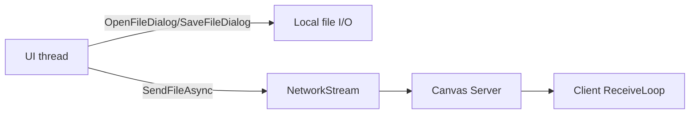

# I/O File / Network (CanvasApp)

Tài liệu này giải thích chi tiết phần I/O File và I/O Network trong CanvasApp: code liên quan, luồng hoạt động, và logic xử lý. Tập trung vào những phần được chấm điểm trong rubric (import/export, đọc config, gửi file chat, và TCP NetworkStream).

---

## 1. Tổng quan I/O trong CanvasApp

CanvasApp có 2 nhóm I/O chính:

* **I/O File**: đọc/ghi file trên máy người dùng (config, import ảnh, export canvas, gửi file chat).
* **I/O Network**: TCP socket trường hợp chính, data truyền bằng JSON + newline qua NetworkStream.

---

## 2. I/O File

### 2.1. Đọc config JSON (Load Balancer)

**Mục đích:** load thông số server và pooling từ `appsettings.json` mà không cần build lại.

* Dùng `File.ReadAllText(...)` để đọc JSON.
* Parse bằng `JObject.Parse`/`JsonConvert`.
* Cho phép thay đổi `MaxConnections`, `Peers`, port... ngay trước demo.

**Logic:**

1. Mở file JSON.
2. Parse ra `ServerSettings` và danh sách backend.
3. Áp dụng cấu hình vào pool + health checker.

### 2.2. Import ảnh nền (Client)

**Mục đích:** người dùng chọn ảnh JPG/PNG làm background của canvas.

**Luồng hoạt động:**

1. `OpenFileDialog` cho người dùng chọn file.
2. `Image.FromFile(path)` đọc ảnh vào memory.
3. Vẽ lại lên panel/bitmap (làm background).
4. Canvas vẽ nét trên lớp trên.

**Note:** File đọc trên máy local, không qua network.

### 2.2b. Import ảnh thành overlay sync mọi client (DRAW_IMAGE)

**Mục đích:** đặt 1 ảnh lên canvas, di chuyển/scale được, đồng bộ tới mọi client trong phòng.

**Luồng hoạt động:**

1. `OpenFileDialog` chọn ảnh.
2. Đọc bytes → encode Base64.
3. Gửi `DRAW_IMAGE` với `{ actionId, points: [topLeft, bottomRight], imageData }`.
4. Server persist (như các action commit khác) → broadcast + PEER_RELAY.
5. Khi user kéo/scale → client gửi `DRAW_IMAGE_TRANSFORM` (chỉ `actionId` + `points`, **không** `imageData`); server **mutate** action hiện có thay vì insert mới — tiết kiệm DB.
6. Implementation ở partial `CanvasForm.Images.cs`.

### 2.3. Export canvas ra PNG/JPEG (Client)

**Mục đích:** lưu canvas hiện tại ra file để nộp bài hoặc chia sẻ.

**Luồng hoạt động:**

1. `SaveFileDialog` cho người dùng chọn đường dẫn + định dạng.
2. `Bitmap.Save(path, ImageFormat.Png/Jpeg)` ghi file.
3. Thông báo thành công trên UI.

**Note:** Export là thao tác local, không cần server.

### 2.4. Gửi file qua chat (Client -> Server -> Client)

**Mục đích:** demo I/O file qua mạng (attach file). Rubric yêu cầu có I/O file + network.

**Luồng hoạt động:**

1. Client chọn file bằng `OpenFileDialog`.
2. Đọc file thành byte[] (giới hạn 2 MB).
3. Encode Base64 (`Convert.ToBase64String`).
4. Gửi message `CHAT_FILE` (JSON).
5. Server broadcast đến các client trong phòng.
6. Client nhận, hiện link tải file.

**Note:** File lưu/tải trên client, server chỉ relay, không persist.

---

## 3. I/O Network (TCP)

### 3.1. NetworkStream + line-delimited JSON

CanvasApp dùng TCP thường, mỗi message là 1 dòng JSON (newline-delimited). Quy ước:

* **Send:** `StreamWriter.WriteLine(...)` + `AutoFlush = true`.
* **Receive:** `StreamReader.ReadLineAsync()`.

Ưu điểm:

* Đơn giản, dễ debug bằng Wireshark.
* Mỗi line là 1 message hoàn chỉnh, dễ parse.

Cần lưu ý:

* `StreamWriter` không thread-safe -> cần lock để tránh interleaving.
* Payload quá lớn bị reject (server có giới hạn).

### 3.2. Lobby socket (short-lived)

**Mục đích:** query 1 lần từ client -> LB -> Canvas server.

Đối tượng: `ROOM_LIST`, `ROOM_CREATE`, `ROOM_RESOLVE`, `RESOLVE_INVITE_CODE`, `ROOM_DELETE`, `ROOM_UPDATE_PASSWORD`.

**Luồng hoạt động:**

1. Mở TCP đến LB.
2. Gửi 1 message.
3. Đọc response (terminal type).
4. Đóng socket.

Lý do: LB chỉ peek **message đầu** trên mỗi socket để quyết định route. Nếu reuse 1 socket cho nhiều request, message đầu route đúng, các message sau ride pipe sai (bug "first-message-pins-route", fix 2026-05-21).

### 3.3. Canvas socket (persistent)

**Mục đích:** kết nối dài hạn để nhận realtime draw/chat.

Tính năng chính:

* **Send lock**: serialize send.
* **Heartbeat**: PING/PONG mỗi 10s.
* **Reconnect**: exponential backoff nếu drop.

**Luồng hoạt động:**

1. Connect đến Canvas Server.
2. Tạo `StreamReader/Writer`.
3. Loop nhận line JSON -> `OnMessageReceived` -> UI update.
4. Khi drop, tự động reconnect.

### 3.4. Threading + I/O flow

---

## 4. Demo runtime (rubric)

### 4.1. I/O File

* Export canvas ra PNG, mở file để thấy đúng hình vẽ.
* Import ảnh nền, thấy background thay đổi.
* Gửi file chat, client khác nhận được và tải về.

### 4.2. I/O Network

* Mở Wireshark, filter `tcp.port == 9000`.
* Vẽ 1 nét, follow TCP stream, thấy JSON `{"Type":"DRAW_END",...}`.

---

## 5. Mapping log liên quan I/O

* `[CHAT_FILE]`/`[CHAT_MESSAGE]`: broadcast từ server.
* `[AutoSave] Snapshot ...`: DB I/O (snapshot) sau khi draw.
* `Unable to read data ...`: socket đóng đột ngột khi client đóng app.

---

## 6. File cần mở khi demo

* Load config JSON: [CanvasApp.LoadBalancer/Program.cs](../../CanvasApp.LoadBalancer/Program.cs)
* Import ảnh nền + overlay: [CanvasApp.Client/Forms/CanvasForm.cs](../../CanvasApp.Client/Forms/CanvasForm.cs) (handler) + [CanvasForm.Images.cs](../../CanvasApp.Client/Forms/CanvasForm.Images.cs) (partial)
* Export PNG/JPEG: [CanvasApp.Client/Forms/CanvasForm.cs](../../CanvasApp.Client/Forms/CanvasForm.cs) (`btnExport.Click`)
* Gửi file chat: [CanvasApp.Client/Forms/CanvasForm.cs](../../CanvasApp.Client/Forms/CanvasForm.cs) (`SendChat` async, OpenFileDialog block ~line 1294)
* Nhận file chat: [CanvasApp.Client/Forms/CanvasForm.cs](../../CanvasApp.Client/Forms/CanvasForm.cs) (decode base64 vào `_chatFiles` ~line 1212; SaveFileDialog ~line 269)
* TCP send/recv persistent: [CanvasApp.Client/Network/CanvasClient.cs](../../CanvasApp.Client/Network/CanvasClient.cs)
* Lobby request ngắn hạn: [CanvasApp.Client/Network/LobbyClient.cs](../../CanvasApp.Client/Network/LobbyClient.cs)
* AES module (opt-in encrypt cho `data`): [CanvasApp.Common/Utils/MessageCrypto.cs](../../CanvasApp.Common/Utils/MessageCrypto.cs), [AesHelper.cs](../../CanvasApp.Common/Utils/AesHelper.cs)

---

## 7. Kết luận

Phần I/O File/Network thể hiện đủ cả thao tác đọc/ghi file local (import/export) và truyền dữ liệu qua TCP (draw/chat/file). Sử dụng line-delimited JSON để dễ debug, và có cơ chế giới hạn payload + send-lock để tránh lỗi interleaving.