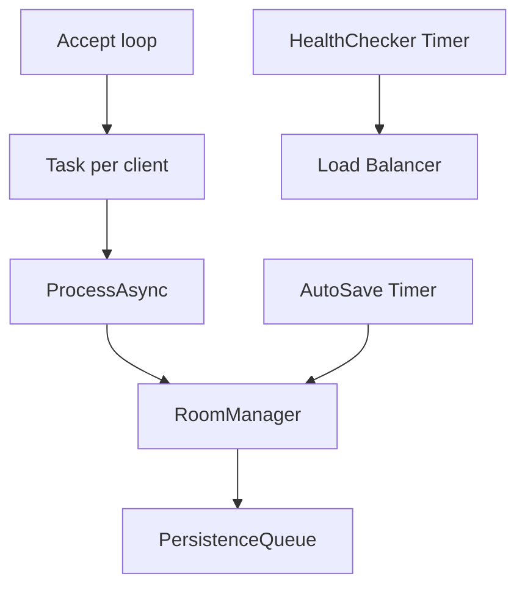

# Thread / Đa luồng (CanvasApp)

Tài liệu này giải thích chi tiết phần Thread / Đa luồng trong CanvasApp: code liên quan, cơ chế hoạt động, và logic đồng bộ. Tập trung vào các pattern trong rubric: async/await, Task.Run, Timer, và thread-safe collections.

---

## 1. Tổng quan model đa luồng

CanvasApp dùng nhiều luồng độc lập để đảm bảo:

* Server phục vụ nhiều client đồng thời không bị block.
* Database write-behind không làm chậm realtime draw.
* Auto-save và health check chạy định kỳ.
* UI WinForms không bị treo do network.

---

## 2. Server: async/await và task per client

### 2.1. Accept loop

Canvas Server dùng TcpListener.AcceptTcpClientAsync() trong vòng lặp. Mỗi lần accept:

* Tạo 1 Task riêng xử lý client (HandleClient).
* Không block accept loop, nên server tiếp tục nhận kết nối mới.

**Logic:**

* 1 kết nối = 1 task.
* Task đọc line JSON liên tục cho tới khi socket đóng.

### 2.2. HandleClient và ProcessAsync

Trong task client:

* Đọc line -> parse Message.
* Gọi ProcessAsync để xử lý từng message.
* Khi socket đóng, gọi Leave() và broadcast cập nhật thành viên.

Điều này đảm bảo:

* Client A bị lag sẽ không ảnh hưởng client B.
* Server vẫn nhận được kết nối mới trong khi đang xử lý client cũ.

---

## 3. Database write-behind: Task.Run + BlockingCollection

### 3.1. Mục tiêu

Lưu draw action vào DB bất đồng bộ để:

* UI vẽ realtime nhanh.
* DB ghi theo batch (tiết kiệm I/O).

### 3.2. Cơ chế

* RoomManager.RecordDrawAction enqueue action vào PersistenceQueue.
* PersistenceQueue chạy task riêng, gom batch và insert.
* Có thể log [PERSISTENCE] batched N actions in X ms để demo.

---

## 4. Timer định kỳ

### 4.1. AutoSave (Canvas Server)

* Dùng System.Timers.Timer.
* Mỗi 60s: tạo snapshot canvas, lưu DB, trim action list.

Mục đích:

* Giảm memory.
* Join lại sẽ tải snapshot + delta.

### 4.2. HealthChecker (Load Balancer)

* Timer mỗi 5s probe các backend.
* Nếu fail 3 lần -> mark DOWN.
* Khi server lên lại -> mark UP.

---

## 5. Thread-safe collections và lock

### 5.1. ConcurrentDictionary

Dùng cho:

* _rooms (danh sách phòng)
* _roomClients (client theo room)
* _canvasState (action list)
* _undoStacks (undo per user/room)

### 5.2. Lock vùng nhạy cảm

* lock(list) khi add/remove client.
* lock(state) khi add/remove draw action.
* SemaphoreSlim để serialize send (StreamWriter không thread-safe).

Mục tiêu:

* Tránh race condition.
* Tránh interleaving JSON khi send.

---

## 6. Client: UI thread và background task

### 6.1. Receive loop

CanvasClient nhận message trên background task:

* Parse message.
* Raise event OnMessageReceived.
* UI layer (Form) dùng Invoke để update UI.

### 6.2. Heartbeat + reconnect

* Heartbeat chạy trong task riêng (PING 10s).
* Reconnect loop chạy task riêng khi socket drop.

Mục tiêu:

* UI không bị treo.
* Tự động phục hồi kết nối.

---

## 7. Demo runtime (rubric)

### 7.1. Multi-client vẽ đồng thời

Mở 3 client, vẽ cùng lúc:

* Mỗi client = 1 task server.
* Không bị block, vẽ realtime.

### 7.2. Chứng minh persistence queue

Log batched insert xuất hiện trong console server.

### 7.3. Chiếu HealthChecker

Log LB hiện probe mỗi 5s, fail 3 lần thì DOWN.

---

## 8. Các điểm cần giải thích khi demo

* Vì sao cần task per client? -> không block, tăng scalability.
* Vì sao cần write-behind queue? -> lưu DB không làm lag vẽ.
* Vì sao cần lock? -> tránh interleaving và race condition.
* Vì sao cần Timer? -> autosave và health check định kỳ.

## 9. File can mo khi demo

- Accept loop + handler: [CanvasApp.Server/Program.cs](CanvasApp.Server/Program.cs#L165-L315)
- Dispatcher: [CanvasApp.Server/Program.cs](CanvasApp.Server/Program.cs#L317-L420)
- Thread-safe collections: [CanvasApp.Server/RoomManager.cs](CanvasApp.Server/RoomManager.cs#L43-L79)
- Persistence queue: [CanvasApp.Common/DataAccess/PersistenceQueue.cs](CanvasApp.Common/DataAccess/PersistenceQueue.cs#L12-L108)
- AutoSave timer: [CanvasApp.Server/AutoSaveService.cs](CanvasApp.Server/AutoSaveService.cs#L18-L94)
- HealthChecker loop: [CanvasApp.LoadBalancer/HealthChecker.cs](CanvasApp.LoadBalancer/HealthChecker.cs#L27-L110)
- Client receive/heartbeat/reconnect: [CanvasApp.Client/Network/CanvasClient.cs](CanvasApp.Client/Network/CanvasClient.cs#L145-L258)

---

## 10. Kết luận

Thiết kế đa luồng của CanvasApp tập trung vào hiệu năng và ổn định: task per client, bất đồng bộ DB, timer định kỳ, và đồng bộ dữ liệu bằng lock/ConcurrentDictionary. Đây là bằng chứng rõ ràng cho phần Thread / Đa luồng trong rubric.